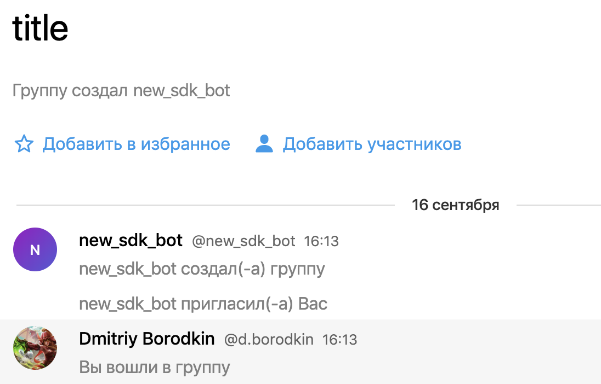

# Groups

<!-- tabs:start -->

#### ** Python **

There are several methods in Python SDK to access the group data (available in ``bot.groups`` subclass):

- **create_group** - create group, first parameter is ``title`` - title of group, second parameter is ``username``, third parameter ``users`` user's outpeer array;
- **search_group_by_shortname** - returns ``Group`` object of group by shortname;

Examples:

```python
bot.groups.create_group('title', 'username') # create group
bot.groups.search_group_by_shortname('username') # return Group object by shortname
```

#### ** Java **

There are several methods in Java SDK to access the group data (available in ``bot.groupsApi()`` subclass):

- **createGroup** - create group, first parameter is ``title`` - title of group (String), second parameter is ``username`` (String), third parameter ``users`` User's array, return Group object;
- **searchGroupByShortname** - returns ``Group`` list object of group by shortname;

Examples:

```java
List<User> users = bot.users().searchUserByNick("admin").get();
Group group = bot.groupsApi().createGroup("title", "username", users).get();
System.out.println(group);
System.out.println(bot.groupsApi().searchGroupByShortname("username").get().get(0));
```

<!-- tabs:end -->

Result:

?> 
