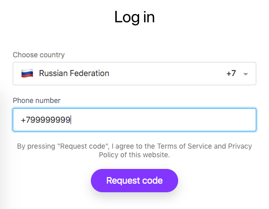
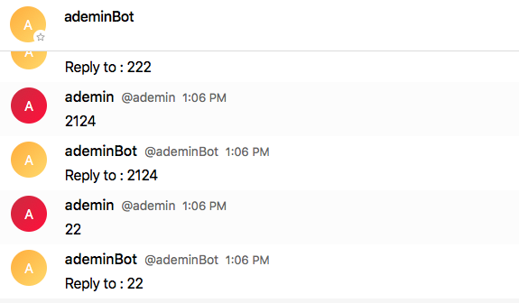

# Usage

## Test endpoint

You can use our test environment for development purposes:

||
| -------------------------------------- | -----------------------------------|
| **Web URL**                            | https://grpс-test.transmit.im      |
| **Endpoint for browser/desktop app**   | https://grpс-test.transmit.im:8443 |
| **Endpoint for bot**                   | grpс-test.transmit.im:9443         |
| **Login**                              | alice                              |
| **Password**                           | password                           |

?> 

Web URL is for accessing messenger through browser. Endpoints for browser or desktop app and
for bot used for connect to Dialog GUI and Dialog API correspondingly.

## Obtaining a token

Dialog bots use token-based authorization. To obtain a token, go to Dialog URL
(for example ``https://grps-test.transmit.im``),
and find Security Bot (@security) - type Security Bot in search bar to find it.
To create a new bot, start conversation with Security Bot and send:
```
/bot new <bot_nickname> <bot_name>
```
?> Notice that `nickname` is unique system name while `name` is displayed in dialog
list and can be non-unique.

## Simple echobot example
Endpoint address and token are all you need to set up your bot. So the full example of simple echobot looks like this:

<!-- tabs:start -->

#### ** Python **

```python
from dialog_bot_sdk.bot import DialogBot
import grpc


def on_msg(*params):
    print('on msg', params)
    bot.messaging.send_message(
        params[0].peer, 'Reply to : ' + str(params[0].message.textMessage.text)
    )


if __name__ == '__main__':
    bot = DialogBot.get_secure_bot(
        'grpc-test.transmit.im:9443',  # bot endpoint
        grpc.ssl_channel_credentials(), # SSL credentials (empty by default!)
        'cbb4994cabfa8d2a5bce0b5f7a44c23da943f767'  # bot token
    )

    bot.messaging.on_message(on_msg)

```

#### ** Java **

```java
import java.util.concurrent.ExecutionException;
import im.dlg.botsdk.Bot;
import im.dlg.botsdk.BotConfig;

public class Main {

    public static void main(String[] args) throws InterruptedException, ExecutionException {

        BotConfig botConfig = BotConfig.Builder.aBotConfig()
                .withHost("grpc-test.transmit.im")
                .withPort(9443)
                .withToken("e60137c00345e62ea8a21506cfe31b2be10852ec").build();

        bot.messaging().onMessage(message ->
                bot.users().get(message.getSender()).thenAccept(userOpt -> userOpt.ifPresent(user -> {
                            System.out.println("Got a message: " + message.getText() + " from user: " + user.getName());
                        })
                ).thenCompose(aVoid -> {
                            bot.messaging().sendText(message.getPeer(), "Reply to : " + message.getMessageContent().toString());
                            return null;
                        }
                ).thenAccept(uuid ->
                        System.out.println("Sent a message with UUID: " + uuid)));

        bot.await();
    }
}
```

#### ** JavaScript **

```javascript
import path from 'path';
import dotenv from 'dotenv';
import Bot, { MessageAttachment, ActionGroup, Action, Button } from '../src';

dotenv.config();

const token = process.env.BOT_TOKEN;
if (typeof token !== 'string') {
  throw new Error('BOT_TOKEN env variable not configured');
}

const bot = new Bot({
  token,
  endpoints: ['https://grpc-test.transmit.im:9443']
});

bot.updateSubject.subscribe({
  next(update) {
    console.log('update', update);
  }
});

bot
  .onMessage(async (message) => {
    if (message.content.type === 'text') {
      const mid = await bot.sendText(
        message.peer,
        message.content.text
      );
    }
  })
  .toPromise()
  .catch((error) => {
    console.error(error);
    process.exit(1);
  });

bot
  .onAction(async (event) => {
    console.log(event);
  })
  .toPromise()
  .catch((error) => {
    console.error(error);
    process.exit(1);
  });
```

<!-- tabs:end -->

Result of echobot's work:

?> 

## Shutdown the bot

To shutdown the bot written on Java or JavaScript you just need to press ``Ctrl+C`` on any platform.
To stop Python-written bots, you need to press ``Ctrl+C`` on Mac/Linux machines
or ``Ctrl+Break`` (``Ctrl+fn+B`` for laptops without Break key) for Windows ones.
